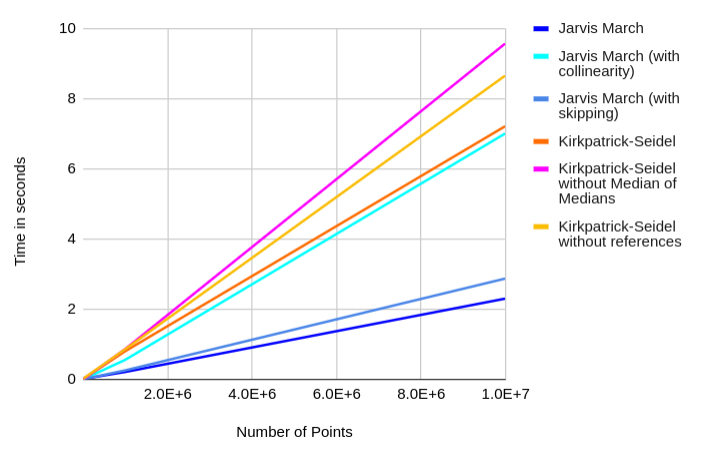
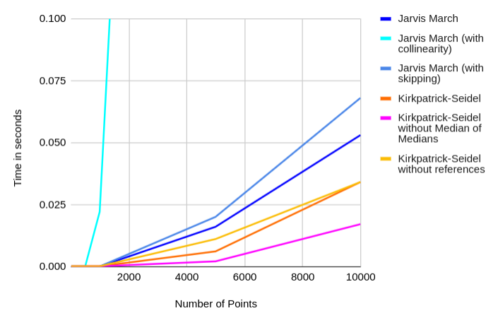

# Analysis and Comparison

# Analysis

## Jarvis March Algorithm

Our implemented Jarvis March Algorithm has time complexity \f$O(nh)\f$, where \f$n\f$ is the number of points in the input and \f$h\f$ is the number of points on the final convex hull. This implementation of the algorithm only outputs the vertices of the convex hull instead of all the points that lie on the convex hull. The case of the implementation not reporting all the points that lie on convex hull arises only when there are collinear points on the convex hull. Further we have made modifications and come up with two more implementations. The variations are as follows:

1. Accounting for collinear points
2. Skipping the current point while iterating over all points

### First Variation

This implementation outputs the all the points that lie on the convex hull but at the cost of a greater time complexity than the original implementation. The calculated time complexity of this algorithm comes out to be \f$O(nhlogn))\f$.

### Second Variation

This was an attempt to improve our implementation where we have modified the code to skip over the `current` point in the `for` loop removing the entire `orientation` computation for every such occurrence.

```cpp
for (int i = 0; i < n; i++)
{
    // the modification
    if (i == current)
        continue;
    if (orientation(points[current], points[i], points[next]) == 2)
    {
        next = i;
    }
}
```

## Kirkpatrick-Seidel Algorithm

Our implemented Kirkpatrick-Seidel Algorithm has time complexity \f$O(nlogh)\f$, where \f$n\f$ is the number of points in the input and \f$h\f$ is the number of points on the final convex hull. This implementation of the algorithm outputs every point on the convex hull, including collinear ones. Further we have made modifications and come up with two more implementations. The variations are as follows:

1. Calculating the median by sorting instead of using the median of medians algorithm
2. Passing arguments to functions as values instead of references

### First Variation

This implementation finds the median by sorting the points instead of using the median of medians algorithm, because despite having higher time complexity, this method tends to be faster on smaller sized inputs due to the high constant factors attached to the median of medians method.

### Second Variation

This variation passes arguments to functions as values instead of references, which takes away the overhead of dereferencing pointers at the cost of storing the values in the system stack. This does not affect the algorithm's time complexity.

# Comparison

We performed the comparison and analysis of the two algorithms by profiling them, with the help of gprof.
We profiled the algorithms on two types of randomly distributed points:

1. A uniform probability distribution within a range
2. An n-sided regular polygon with points randomly generated in its interior

We also varied the number of input points from 10E1 to 10E7 for distribution 1, and from 10E1 to 10E4 for distribution 2.

Furthermore, we also experimented with a few variations in our implementations of our algorithms to find their impact on the performance of our code, as detailed above.

## Uniform probability distribution

Below is a table of the average runtimes in seconds of the algorithms for a given input size.

| Number of Points | Jarvis March | Jarvis March (with collinearity) | Jarvis March (with skipping) | Kirkpatrick-Seidel | Kirkpatrick-Seidel without Median of Medians | Kirkpatrick-Seidel without references |
| ---------------- | ------------ | -------------------------------- | ---------------------------- | ------------------ | -------------------------------------------- | ------------------------------------- |
| 10               | 0            | 0                                | 0                            | 0                  | 0                                            | 0                                     |
| 100              | 0            | 0                                | 0                            | 0                  | 0                                            | 0                                     |
| 1000             | 0            | 0                                | 0                            | 0                  | 0                                            | 0                                     |
| 10000            | 0            | 0                                | 0                            | 0.004              | 0                                            | 0.009                                 |
| 100000           | 0.014        | 0.039                            | 0.018                        | 0.065              | 0.066                                        | 0.084                                 |
| 1000000          | 0.193        | 0.539                            | 0.244                        | 0.786              | 0.848                                        | 0.844                                 |
| 10000000         | 2.285        | 6.996                            | 2.863                        | 7.204              | 9.563                                        | 8.649                                 |

The above table represented as a graph:



## Regular Polygon

Below is a table of the average runtimes in seconds of the algorithms for a given input size.

| Number of Points | Jarvis March | Jarvis March (with collinearity) | Jarvis March (with skipping) | Kirkpatrick-Seidel | Kirkpatrick-Seidel without Median of Medians | Kirkpatrick-Seidel without references |
| ---------------- | ------------ | -------------------------------- | ---------------------------- | ------------------ | -------------------------------------------- | ------------------------------------- |
| 10               | 0            | 0                                | 0                            | 0                  | 0                                            | 0                                     |
| 50               | 0            | 0                                | 0                            | 0                  | 0                                            | 0                                     |
| 100              | 0            | 0                                | 0                            | 0                  | 0                                            | 0                                     |
| 500              | 0            | 0                                | 0                            | 0                  | 0                                            | 0                                     |
| 1000             | 0            | 0.022                            | 0                            | 0                  | 0                                            | 0                                     |
| 5000             | 0.016        | 0.921                            | 0.02                         | 0.006              | 0.002                                        | 0.011                                 |
| 10000            | 0.053        | 3.369                            | 0.068                        | 0.034              | 0.017                                        | 0.034                                 |

The above table represented as a graph:



## Observations

-   For a uniform distribution, Jarvis March comfortably outperforms Kirkpatrick-Seidel, while the reverse is true for a polygonal distribution. We may infer that this is because, in our uniform distribution at higher point counts, enough points tend to end up near the edges of our spacial boundaries that the hull ends up mostly having the shape of our boundaries itself, and a large majority of the points are on its inside. In this case, since the number of points on the hull, \f$h\f$, is much smaller than the total number of points, the difference in \f$h\f$ and \f$logh\f$ is not significant, and therefore the lesser constant factor in Jarvis March ends up being enough to make it faster than Kirkpatrick-Seidel. On the other hand, in a polygonal distribution, the number of points on the hull is much closer to the total number of points, and the difference in \f$h\f$ and \f$logh\f$ is significant, making Kirkpatrick-Seidel faster than Jarvis March.
-   Jarvis March for a uniform distribution with 10E7 points: 

-   Kirkpatrick-Seidel for a uniform distribution with 10E7 points: 
-   We can see that a significant amount of time is being spent in the median of medians and quick select functions in the Kirkpatrick-Seidel algorithm, as well as a lot of `push_back` operations being performed on vectors, which also contributes to the runtime.

-   Jarvis March for a polygonal distribution with 10E4 points: 
-   Kirkpatrick=Seidel for a polygonal distribution with 10E4 points: 
-   Here, we see that with this distribution of points, Kirkpatrick-Seidel performs better than Jarvis March, and the median of medians and quick select functions are not as costly.

-   We can also see that for smaller numbers (n < 10E5), Kirkpatrick-Seidel performs better or as well as by calculating the median by sorting instead of using median of medians.
-   With median of medians for 10E5 points: 
-   Without median of medians for 10E5 points: 
-   This result can be explained by the fact that `std::sort()` uses the introselect algorithm, which itself is a combination of quick select and heap select to achieve a best-case time complexity of \f$O(n)\f$, and a worst case time complexity of \f$O(nlogn)\f$. The median of medians algorithm meanwhile, has a best and worst case time complexity of \f$O(n)\f$. Furthermore, introselect does less constant work per item, making it faster than median of medians for \f$O(n)\f$ cases.

## References

1. Musser, D. R. (1997). Introspective sorting and selection algorithms. Software: Practice and Experience, 27(8), 983-993.
