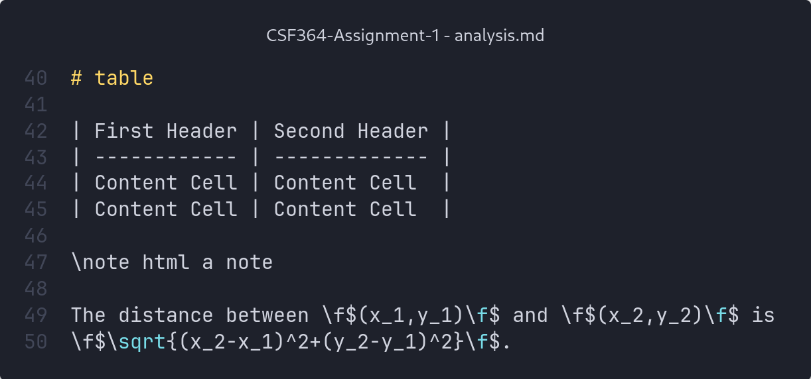

# Comparison and Analysis

We performed the comparison and analysis of the two algorithms by profiling them, with the help of gprof.
We profiled the algorithms on two types of randomly distributed points:

1. A uniform probability distribution within a range
2. An n-sided regular polygon with points randomly generated in its interior

We also varied the number of input points from 10E1 to 10E7 for distribution 1, and from 10E1 to 10E4 for distribution 2.

Furthermore, we also experimented with a few variations in our implementations of our algorithms to find their impact on the performance of our code.

For Jarvis March, the variations are as follows:

1. Accounting for collinear points
2. Skipping the current point while iterating over all points

For Kirkpatrick-Seidel, the variations are as follows:

1. Calculating the median by sorting instead of using the median of medians algorithm
2. Passing arguments to functions as values instead of references

# Testing 2

```cpp
for (int i = 0; i < n; i++)
        {
            if (i != current && i != next)
            {
                if ((find(convexHull.begin(), convexHull.end(), points[i]) == convexHull.end()) &&
                    orientation(points[current], points[i], points[next]) == 0)
                {
                    convexHull.push_back(points[i]);
                }
            }
        }
```

-   something
-   something
-   something
-   something
-   something
-   [ ] checklist
-   [x] checklist

[Link to Convex Hull Algorithm](@ref ConvexHullAlgorithm)

`Lorem ipsum dolor sit amet.`

> Lorem ipsum dolor sit amet.



# Uniform probability distribution

Below is a table of the average runtimes in seconds of the algorithms for a given input size.

| Number of Points | Jarvis March | Jarvis March (with collinearity) | Jarvis March (with skipping) | Kirkpatrick-Seidel | Kirkpatrick-Seidel without Median of Medians | Kirkpatrick-Seidel without references |
| ---------------- | ------------ | -------------------------------- | ---------------------------- | ------------------ | -------------------------------------------- | ------------------------------------- |
| 10               | 0            | 0                                | 0                            | 0                  | 0                                            | 0                                     |
| 100              | 0            | 0                                | 0                            | 0                  | 0                                            | 0                                     |
| 1000             | 0            | 0                                | 0                            | 0                  | 0                                            | 0                                     |
| 10000            | 0            | 0                                | 0                            | 0.004              | 0                                            | 0.009                                 |
| 100000           | 0.014        | 0.039                            | 0.018                        | 0.065              | 0.066                                        | 0.084                                 |
| 1000000          | 0.193        | 0.539                            | 0.244                        | 0.786              | 0.848                                        | 0.844                                 |
| 10000000         | 2.285        | 6.996                            | 2.863                        | 7.204              | 9.563                                        | 8.649                                 |

# Regular Polygon

Below is a table of the average runtimes in seconds of the algorithms for a given input size.

| Number of Points | Jarvis March | Jarvis March (with collinearity) | Jarvis March (with skipping) | Kirkpatrick-Seidel | Kirkpatrick-Seidel without Median of Medians | Kirkpatrick-Seidel without references |
| ---------------- | ------------ | -------------------------------- | ---------------------------- | ------------------ | -------------------------------------------- | ------------------------------------- |
| 10               | 0            | 0                                | 0                            | 0                  | 0                                            | 0                                     |
| 50               | 0            | 0                                | 0                            | 0                  | 0                                            | 0                                     |
| 100              | 0            | 0                                | 0                            | 0                  | 0                                            | 0                                     |
| 500              | 0            | 0                                | 0                            | 0                  | 0                                            | 0                                     |
| 1000             | 0            | 0.022                            | 0                            | 0                  | 0                                            | 0                                     |
| 5000             | 0.016        | 0.921                            | 0.02                         | 0.006              | 0.002                                        | 0.011                                 |
| 10000            | 0.053        | 3.369                            | 0.068                        | 0.034              | 0.017                                        | 0.034                                 |

\note html a note

The distance between \f$(x_1,y_1)\f$ and \f$(x_2,y_2)\f$ is
\f$\sqrt{(x_2-x_1)^2+(y_2-y_1)^2}\f$.

# References

-   https://www.doxygen.nl/manual/formulas.html
-   https://www.doxygen.nl/manual/markdown.html
